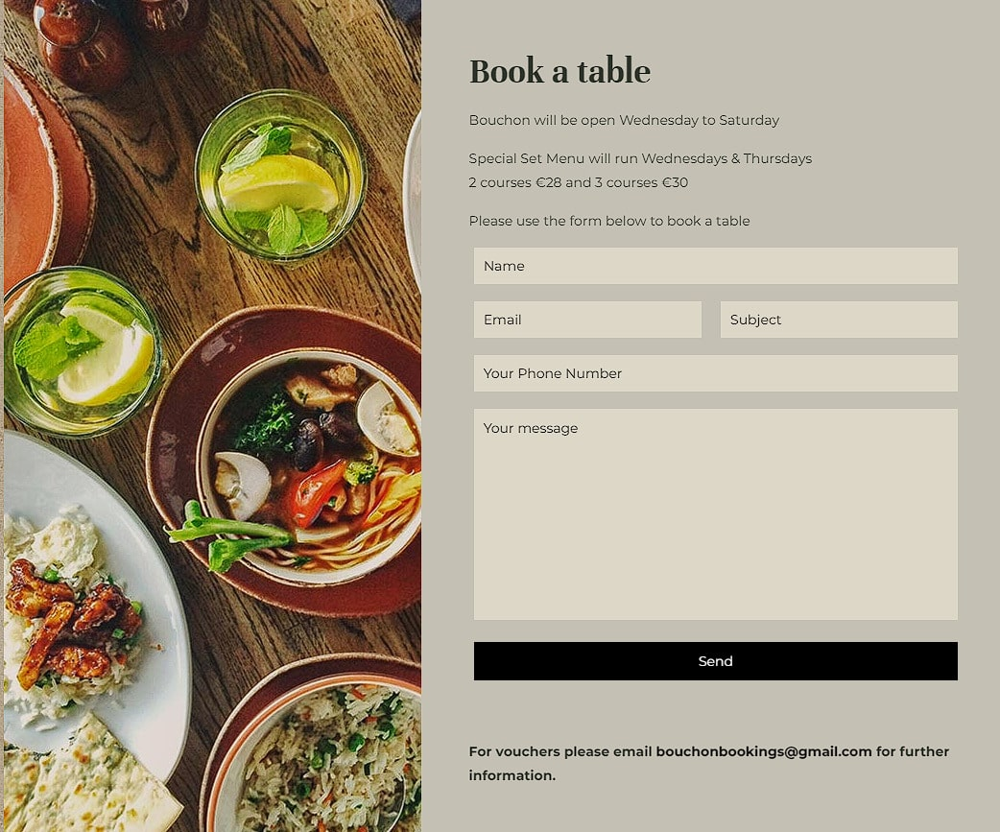
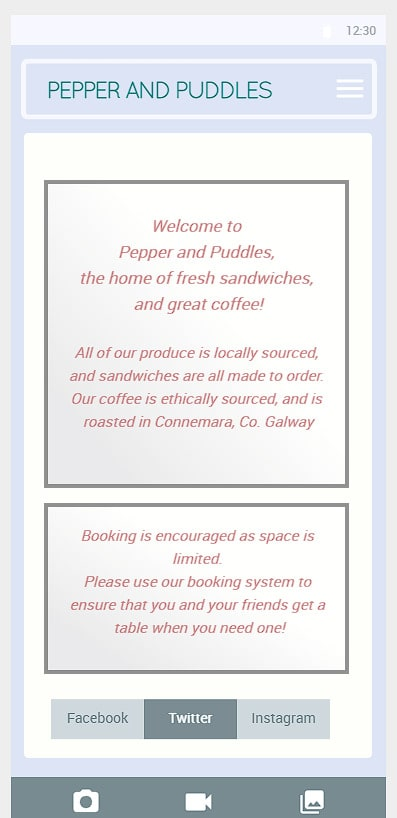
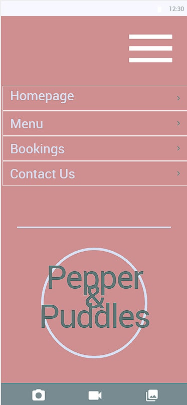

# Pepper and Puddles

- This is a restaurant reservation web application using Python with Django, and a Postgres relational database.
- The site has a model view controller to allow customers to make bookings following CRUD principles, and to give administrative access to the site owner only.

# Agile Development

- This project follow Agile principles and methodologies through assessing the Clear Value Proposition of User Stories
- These User Stories are considered in 5 steps. Stories are articulated, discussed, the acceptable solution is defined, the necessary task required is identified, and finally completion is verified.

- Making the Reservation functionality
- I have created a function that requests date, time, name, phone, and, email from the user.
- On a successful submission, the user should be brought to a confirmation.html page.
- Missing positional argument of Table ID, perhaps Table ID not yet defined, could work later, removed for now temporarily.

- Additional page is necessary, booking confirmation page added.
- Additional page, view_bookings, created.

- Moved all html files to templates within the booking app. Expect that the site should work from index onwards through the templates.

- Classes successfuly appear in admin panel
- Two objects have been created in the admin panel for classes of bookings, and have been successfully rendered in a template view.

## A) Customer Stories
I want to be able to book a table a specific time and party size
- Discuss: The user needs to make a booking tailored to their requirements, they need to be able to relay this information to the restaurant
- Define Acceptance:
- Identify Task Required:
- Verify Completion:

I want to have my booking confirmed
- Discuss: The user needs to receive feedback to confirm that their data manipulation was successful, they may also need secondary feedback that the booking has been seen and confirmed by the restaurant, not just that the website behaved correctly.
- Define Acceptance:
- Identify Task Required:
- Verify Completion:

I want to be able to amend by booking if necessary
- Discuss: Bookings often need to be altered or cancelled, it would be helpful if the user had a way of retrieving their own booking entry and making the changes they need. Though the parameters of the changes should be confined to the restaurants current availability, rather than that of when the booking was originally made.
- Define Acceptance:
- Identify Task Required:
- Verify Completion:

I want to see what food is on offer
- Discuss: Users need to see if the food being offered is what they're looking for, to see if it will cater to the needs of their party, and assess if the price is appropriate.
- Define Acceptance:
- Identify Task Required:
- Verify Completion:

## B) Restaurant Owner Stories
I want the site to be appealing and accessible to my customers
- Discuss: Hospitality is a competitive business, businesses want to be able to stand out from the competition. A lot of users are familiar with competitors sites, our one should be just as good as any other if not better.
- Define Acceptance:
- Identify Task Required:
- Verify Completion:

I want the booking details to be clear
- Discuss: Making a booking is the equivilant of making a sale. It should not be a frustrating or difficult process. It needs to be simple, secure, and reliable.
- Define Acceptance:
- Identify Task Required:
- Verify Completion:

I want to be able to contact booked customers
- Discuss: The restaurant may need to be able to contact someone in relation to a booking for numerous reasons. Bookings should require an email or phone number be provided.
- Define Acceptance:
- Identify Task Required:
- Verify Completion:

I want an attractive home page, that lures the customer in
- Discuss: The homepage will be the first thing a customer sees. It should reflect the nature of the business, and look inviting, striking, and provide clear direction towards the sections the user may have come to visit for.
- Define Acceptance:
- Identify Task Required:
- Verify Completion:

I want to showcase the food that we offer and highlight positive reviews
- Discuss: It is important that the customer can see that we provide delicious food, so that they can trust us to deliver when they arrive for their booking. Testimonails from regular patrons, and photos of the restaurant and the food can help showcase that our standards are authentic.
- Define Acceptance:
- Identify Task Required:
- Verify Completion:

## C) Developer Stories
I want to avoid any possibility of double bookings
- Discuss: The restaurant has limited space. We need to maximise the amount of bookings they can fit into different time slots, while avoiding over booking the venue. If a double booking were to occur it could damage the restaurants reputation, and relationship with a customer.
- Define Acceptance:
- Identify Task Required:
- Verify Completion:

I want to keep the restaurant's admin view private
- Discuss: The booking management system should only be accessible to the business. Users should only be able to manipulate their own bookings, they should not be able to see any information about other patrons bookings. All the information should be clearly displayed to the restaurant owner.
- Define Acceptance:
- Identify Task Required:
- Verify Completion:

I want customers to be able to return to the site and retrieve and amend their booking details
- Discuss: Customers might be able to call on their specific booking on our site by using a booking reference number that we provide them on confirmation of their initial booking. They should be able to request different time slots, party-sizes, or even cancel their booking. Alteration should require confirmation from the restaurant owner and return that feedback to the customer. Cancellations should be prominently notified to the restaurant owner.
- Define Acceptance:
- Identify Task Required:
- Verify Completion:

I want a navigation bar so that a customer can easily access the funtionality they want.
- Discuss: The customer needs to know how to use our site as soon as the arrive on the homepage.
- Define Acceptance:
- Identify Task Required:
- Verify Completion:

I want to include social media links, contact information, and restaurant location to the customers
- Discuss: Using a google maps widget could help customers with directions to the restaurant, social media could expand on page 2s purpose of providing photos and affirmation of product.
- Define Acceptance:
- Identify Task Required:
- Verify Completion:

# Planning Layout

Our website will have several pages. They will be in a specific order based on the customers journey. That journey would look something like welcoming them first, assuring them that we're reliable, inviting them to visit, providing info on how to visit.

1. Homepage
This will be attractive, to lure the customer in. It will have a navigation bar to allow customers to easily reach the parts of the site that they need. It will have a small blub about the restaurant. Social media links will be included in the footer or header. The restaurants name will be written large.

2. Menu and testimonials
Before inviting the customer to make a booking we want to advertise our product and service. To instill faith in the viewerr that we are a good restaurant we will include a page with positive reviews from past customers, maybe a link to an article by a food critic, and professionally photographed examples of our dishes. We would also like to include our menu, so that customers know what to expect when they book with us. This would lead to less cancellations, as the customers will be able to tell if they are happy to dine with us.

3. Our bookings page
This page should allow the users to see what time slot availabilities are open to them for bookings. It shouldn't allow users to double book slots, or book on days we are closed. The user should be able to include a short message such as for dietary requirements. They should be able to include their contact details, party size, and requested time.

For our Restaurant Admin View we could have this page be entirely replaced with the control panel for the bookings. The restaurant owner should be able to see the bookings that have been made, with relevant information: contact details, party size, time slot, any message included. The owner should be able to easily tell what slots are still available. The owner should be able to confirm all bookings with the customers, and be able to delete any bookings where necessary. This page should be secure, and accessible to the owner only.

4. Contact Us
The last page should be details of the location of our premises, as well as any other contact details, address, email address, contact number, and social media links.

### Example Sites

- Calendar booking vs Email/Message request
Below are examples of different approaches to take bookings by real-life restaurants. The first uses a popular booking service provider and has their unifrom set-up. The second is a less sophisticated system that allows the user to supply the restaurant with a message and contact details. The system of booking must be performed by the restaurant owner instead of being managed by the site.

 

### Wireframes

- Homepage for mobile

- Dropdown menu for mobile

# Credits

Bootstrap
- Dropdown Menu

# Testing

- Created booking app, tested functionality by using command line "python3 manage.py runserver".
H1 html text showing in server. App set up successfully.

- Created Admin by usering createsuperuser command line, verified by signing in following url admin path on open server"

- Form will not create object for booking. Solution: Changed action in form to call on view function, imported redirect to views