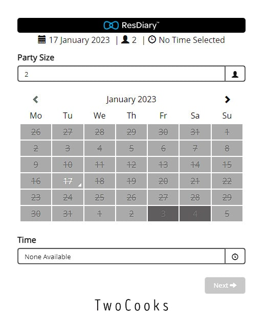

# Pepper and Puddles

- This is a restaurant reservation web application using Python with Django, and a Postgres relational database.
-- The site has a model view controller to allow customers to make bookings following CRUD principles, and to give administrative access to the site owner only.

# Agile Development

- This project follow Agile principles and methodologies through assessing the Clear Value Proposition of User Stories
-- These User Stories are considered in 5 steps. Stories are articulated, discussed, the acceptable solution is defined, the necessary task required is identified, and finally completion is verified.

## A) Customer Stories
I want to be able to book a table a specific time and party size
- Discuss: 
- Define Acceptance:
- Identify Task Required:
- Verify Completion:

I want to have my booking confirmed
- Discuss: 
- Define Acceptance:
- Identify Task Required:
- Verify Completion:

I want to be able to amend by booking if necessary
- Discuss: 
- Define Acceptance:
- Identify Task Required:
- Verify Completion:

I want to see what food is on offer
- Discuss: 
- Define Acceptance:
- Identify Task Required:
- Verify Completion:

## B) Restaurant Owner Stories
I want the site to be appealing and accessible to my customers
- Discuss: 
- Define Acceptance:
- Identify Task Required:
- Verify Completion:

I want to booking details to be clear
- Discuss: 
- Define Acceptance:
- Identify Task Required:
- Verify Completion:

I want to be able to contact booked customers
- Discuss: 
- Define Acceptance:
- Identify Task Required:
- Verify Completion:

I want an attractive home page, that lures the customer in
- Discuss: 
- Define Acceptance:
- Identify Task Required:
- Verify Completion:

I want to showcase the food that we offer and highlight positive reviews
- Discuss: 
- Define Acceptance:
- Identify Task Required:
- Verify Completion:

## C) Developer Stories
I want to avoid any possibility of double bookings
- Discuss: 
- Define Acceptance:
- Identify Task Required:
- Verify Completion:

I want to keep the restaurants admin view private
- Discuss: 
- Define Acceptance:
- Identify Task Required:
- Verify Completion:

I want customers to be able to return to the site and retrieve and amend their booking details
- Discuss: 
- Define Acceptance:
- Identify Task Required:
- Verify Completion:

I want a navigation bar so that a customer can easily access the funtionality they want.
- Discuss: 
- Define Acceptance:
- Identify Task Required:
- Verify Completion:

I want to include social media links, contact information, and restaurant location for the customers
- Discuss: 
- Define Acceptance:
- Identify Task Required:
- Verify Completion:

# Planning Layout

Our website will have several pages. They will be in a specific order based on the customers journey. That journey would look something like welcoming them first, assuring them that we're reliable, inviting them to visit, providing info on how to visit.

1. Homepage
This will be attractive, to lure the customer in. It will have a navigation bar to allow customers to easily reach the parts of the site that they need. It will have a small blub about the restaurant. Social media links will be included in the footer or header. The restaurants name will be written large.

2. Menu and testimonials
Before inviting the customer to make a booking we want to advertise our product and service. To instill faith in the viewerr that we are a good restaurant we will include a page with positive reviews from past customers, maybe a link to an article by a food critic, and professionally photographed examples of our dishes. We would also like to include our menu, so that customers know what to expect when they book with us. This would lead to less cancellations, as the customers will be able to tell if they are happy to dine with us.

3. Our bookings page
This page should allow the users to see what time slot availabilities are open to them for bookings. It shouldn't allow users to double book slots, or book on days we are closed. The user should be able to include a short message such as for dietary requirements. They should be able to include their contact details, party size, and requested time.

For our Restaurant Admin View we could have this page be entirely replaced with the control panel for the bookings. The restaurant owner should be able to see the bookings that have been made, with relevant information: contact details, party size, time slot, any message included. The owner should be able to easily tell what slots are still available. The owner should be able to confirm all bookings with the customers, and be able to delete any bookings where necessary. This page should be secure, and accessible to the owner only.

4. Contact Us
The last page should be details of the location of our premises, as well as any other contact details, address, email address, contact number, and social media links.

### Example Sites

- Calendar booking vs Email/Message request
Below are examples of different approaches to take bookings by real-life restaurants. The first uses a popular booking service provider and has their unifrom set-up. The second is a less sophisticated system that allows the user to supply the restaurant with a message and contact details. The system of booking must be performed by the restaurant owner instead of being managed by the site.

 

### Wireframes

- Homepage for mobile

- Dropdown menu for mobile

